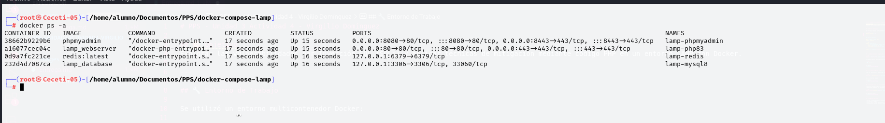
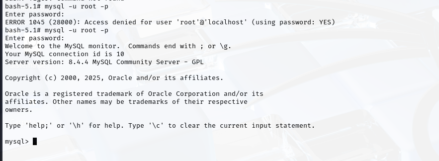
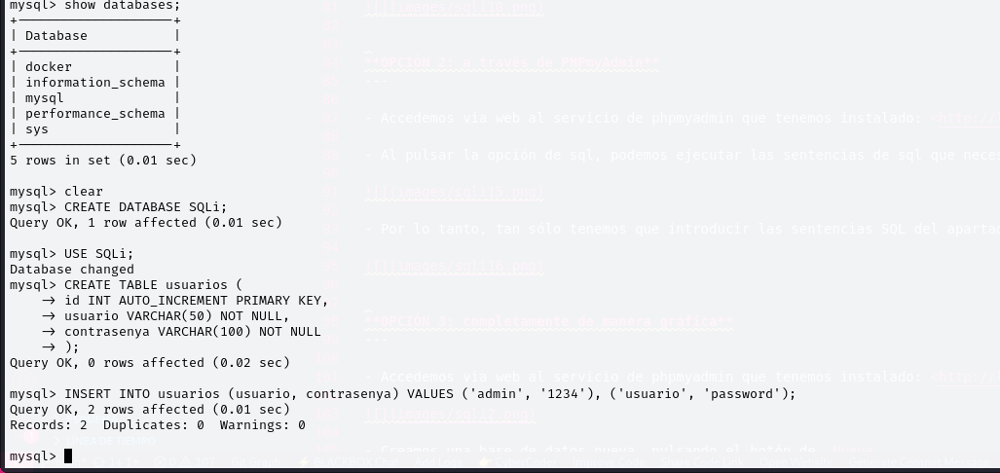
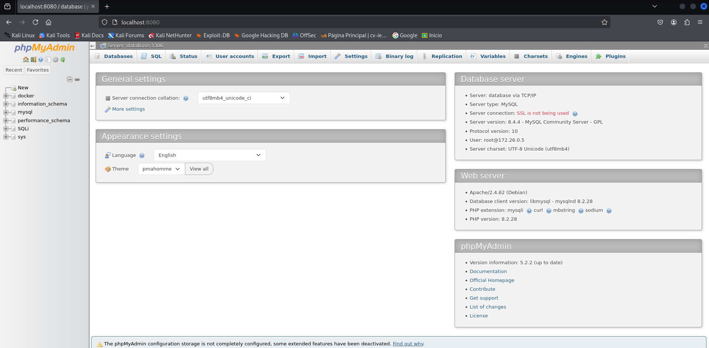
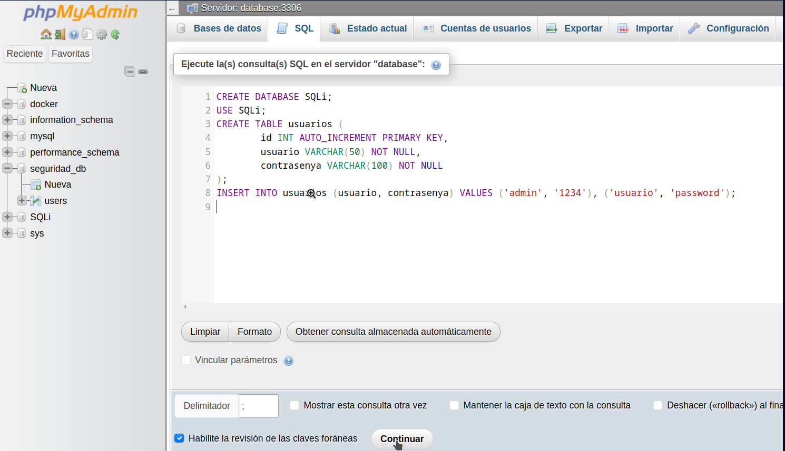
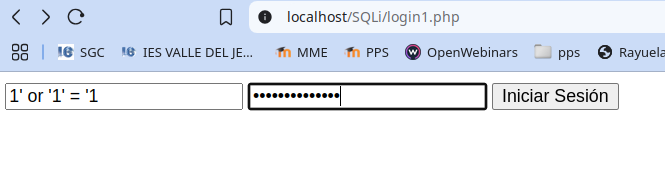

# PPS - Unidad 3 Actividad 4 - Virgilio Domínguez

## 🎯 Objetivo
Explorar las vulnerabilidades por Inyección SQL (SQLi) y aplicar técnicas de mitigación mediante código PHP en un entorno LAMP con Docker.

---

## 🔧 Entorno de Trabajo

Se utilizó un entorno multicontenedor Docker:


docker-compose up -d



## 🗃️ Base de Datos

Base de datos creada: `SQLi`  
Tabla: `usuarios`


```sql
CREATE TABLE usuarios (
    id INT AUTO_INCREMENT PRIMARY KEY,
    usuario VARCHAR(50) NOT NULL,
    contrasenya VARCHAR(100) NOT NULL
);



INSERT INTO usuarios (usuario, contrasenya) VALUES ('admin', '1234'), ('usuario', 'password');
```

---

## ⚠️ Código vulnerable (login1.php)

```php
$query = "SELECT * FROM usuarios WHERE usuario = '$username' AND contrasenya = '$password'";
```

🔴 Permite ejecutar código malicioso como:

```sql
' OR '1'='1' -- -
```

🧪 Captura:


---

## 🛡️ Primera Mitigación (login2.php)

✅ Se usó `addslashes()` para escapar caracteres peligrosos.

```php
$username = addslashes($_POST["username"]);
```

🔴 Aún no es 100% seguro.

🧪 Captura:


---

## ✅ Mitigación final con Prepared Statements (login3.php)

- Consultas parametrizadas con `prepare()` y `bind_param()`.
- Contraseñas hasheadas con `password_hash()` y verificadas con `password_verify()`.

```php
$stmt = $conn->prepare("SELECT id, usuario, contrasenya FROM usuarios WHERE usuario = ?");
```

🧪 Captura de éxito:


---

## 🔐 Seguridad Adicional

- Uso de `htmlspecialchars()` para evitar XSS
- Validación de campos
- Control de errores en la conexión y ejecución de consultas
- Recomendación de usar sesiones (`session_start()`) en producción

---
