# PPS-Unidad3Actividad4-InyeccionSQL

Explotación y Mitigación de SQL Injection (SQLi)

Tenemos como objetivo:

> - Recordar cómo se pueden hacer ataques de inyección de SQL
>
> - Analizar el código de la aplicación que permite inyección SQL
>
> - Implementar diferentes modificaciones del codigo para aplicar mitigaciones o soluciones.

# ¿Qué es SQL Injection (SQLi)?
---
**SQL Injection (SQLi)**  es un tipo de ataque en el que un atacante inserta código SQL malicioso en una consulta a la base de datos, con el objetivo de manipular, robar o eliminar información sensible.

Este ataque ocurre cuando una aplicación no valida correctamente la entrada del usuario y ejecuta consultas SQL dinámicas sin medidas de seguridad.

## ACTIVIDADES A REALIZAR

> Lee detenidamente la sección de [Inyección SQL de la página de PortWigger](https://portswigger.net/web-security/sql-injection)
>
> Lee el siguiente [documento sobre Explotación y Mitigación de ataques de Inyección SQL](files/ExplotacionYMitigacionSQLInjection.pdf) de Raúl Fuentes. Nos va a seguir de guía para aprender a explotar y mitigar ataques de inyección SQL en nuestro entorno de pruebas.
>
> También y como marco de referencia, tienes [ la sección de correspondiente de inyección de SQL de la **Proyecto Web Security Testing Guide** (WSTG) del proyecto **OWASP**.](https://owasp.org/www-project-web-security-testing-guide/stable/4-Web_Application_Security_Testing/07-Input_Validation_Testing/05-Testing_for_SQL_Injection)

Vamos realizando operaciones:

### Iniciar entorno de pruebas

-Situáte en la carpeta de del entorno de pruebas de nuestro servidor LAMP e inicia el escenario multicontenedor: 

~~~
docker-compose up -d
~~~

### Creación de base de datos

Para crear la Base de datos que vamos a utilizar para esta actividad tenemos varias opciones:

**OPCIÓN 1: Desde terminal**
---

Recordamos que nuestra base de datos se encuentra, en mi caso, en el contenedor _lamp-mysql18_, por lo que tenemos que conectarnos al servidor de MySQL que se encuentra en dicha máquina:

~~~
docker exec -it  lamp-mysql8  /bin/bash
~~~

Una vez dentro nos conectamos con la base de datos:

~~~
mysql -u root -p
~~~
Puedes ver el proceso en a siguiente imagen:

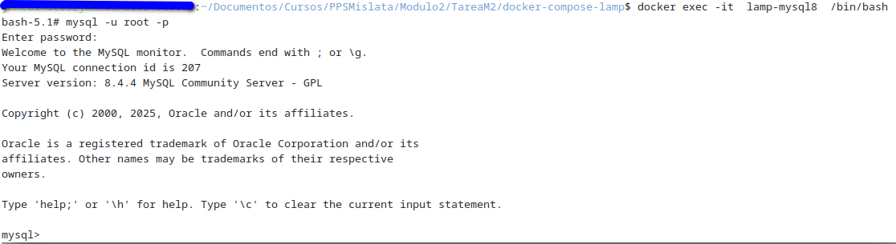

y una vez conectado introducimos las consultas sql necesarias para crear la base de datos, tabla e introducir los datos de los usuarios:

~~~
CREATE DATABASE SQLi;
USE SQLi;
CREATE TABLE usuarios (
	id INT AUTO_INCREMENT PRIMARY KEY,
	usuario VARCHAR(50) NOT NULL,
	contrasenya VARCHAR(100) NOT NULL
);
INSERT INTO usuarios (usuario, contrasenya) VALUES ('admin', '1234'), ('usuario', 'password');
~~~

Vemos como se ha creado correctamente, tanto Base de Datos, como tabla y usuarios:

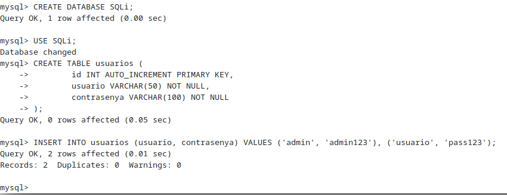

**OPCIÓN 2: a través de PHPmyAdmin**
---

- Accedemos via web al servicio de phpmyadmin que tenemos instalado: <http://localhost:8080>

- Al pulsar la opción de sql, podemos ejecutar las sentencias de sql que necesitemos.

- Por lo tanto, tan sólo tenemos que introducir las sentencias SQL del apartado anterior.

**OPCIÓN 3: completamente de manera gráfica**
---

- Accedemos via web al servicio de phpmyadmin que tenemos instalado: <http://localhost:8080>

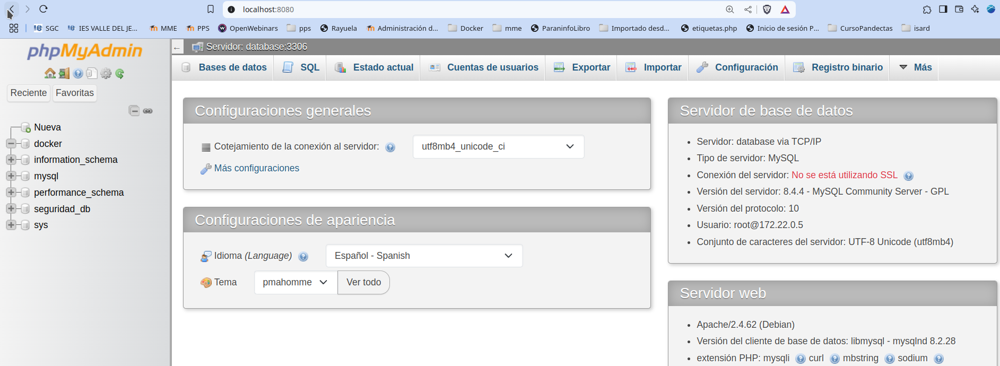

- Creamos una base de datos nueva, pulsando el botón de _Nueva_

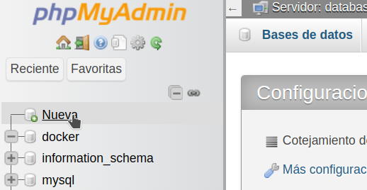

- Vamos a llamar a la tabla SQLi

- Una vez creada, inmediatamente nos sugiere que creemos una tabla nueva. La tabla que necesitamos se llamará **Usuarios* y debe de tener 3 columnas:**id, nombre y contrasenya**, cada una con su tipo de valor correspondiente.

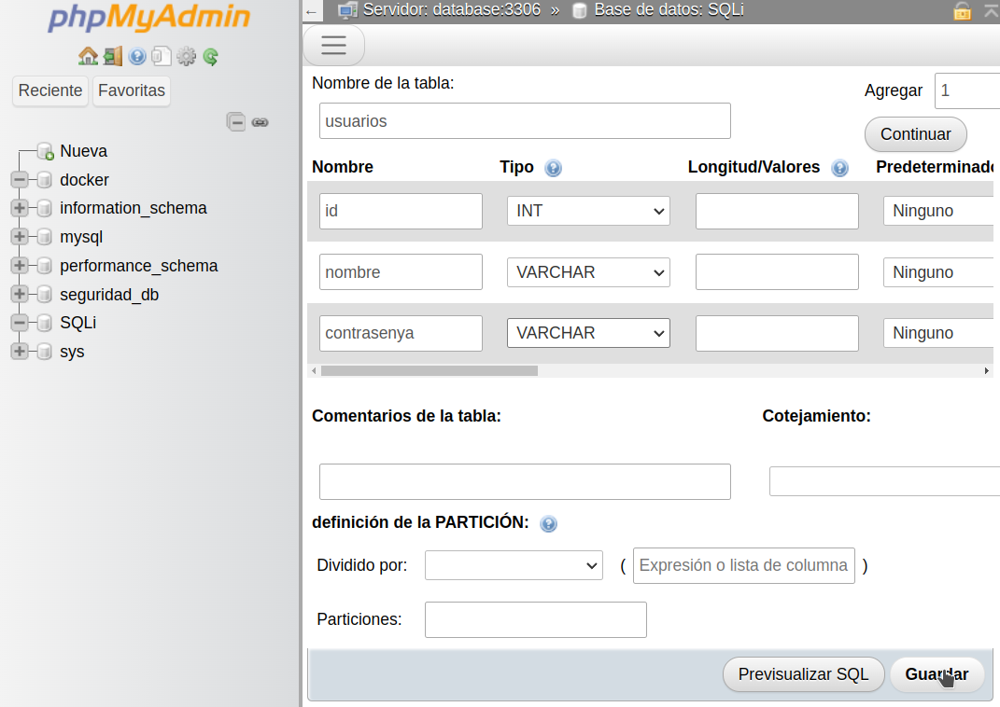

- Una vez creada podemos introducir los valores de los usuarios que queramos pulsando en **Insertar**

- e introducimos los valores que queremos. 

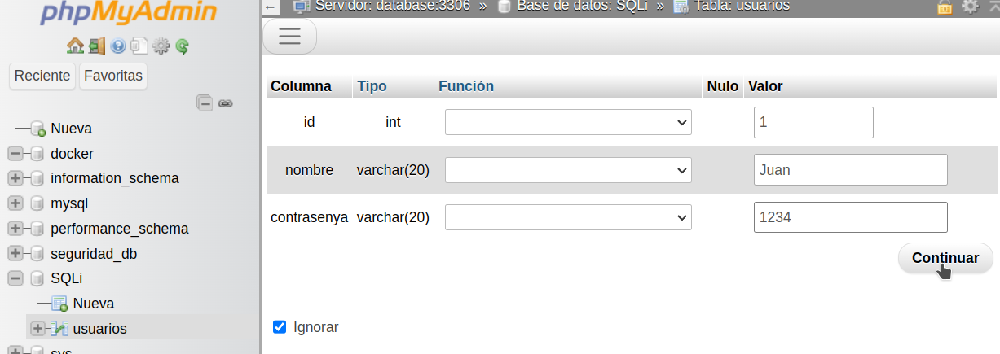

 
### Crear página web en Apache

Vamos a crear una web con la que podamos explotar la vulnerabilidad de Inyección SQL. Esta aplicación o código debe de estar alojado en nuestro servidor web Apache.

Recordamos que en nuestro docker-compose hemos creado un volumen bind-mount para poder utilizar los archivos de nuestro sistema anfitrión. En concreto, tenemos una carpeta www que se monta en la carpeta **/var/www/html** del servidor web. Por lo tanto es muy sencillo colocar en el servidor, los archivos y carpetas que queramos.

- Me situo en la carpeta _./www_ y creo una carpeta con nombre SQLi  para esta actividad.

- Creo dentro de esa carpeta un archivo PHP con nombre **login1.php**, con el siguiente contenido:

¡¡¡OJO¡¡¡ que en la 2ª linea hay que cambiar PasswordBBDD por la contraseña de root de tu BBDD (recuerda que la tienes en la configuración de variables de entorno, el archivo .env).

~~~
<?php
$conn = new mysqli("database", "root", "password", "SQLi");
        if ($_SERVER["REQUEST_METHOD"] == "POST") {
                $username = $_POST["username"];
                $password = $_POST["password"];
                $query = "SELECT * FROM usuarios WHERE usuario = '$username' AND contrasenya = '$password'";
                echo "Consulta ejecutada: " . $query . " ";
                $result = $conn->query($query);
                if ($result) {
                        if ($result->num_rows > 0) {
                                echo "Inicio de sesión exitoso ";
                                // Modificación: Mostrar datos extraídos de la consulta
                                while ($row = $result->fetch_assoc()) {
                                        echo "ID: " . $row['id'] . " - Usuario: " . $row['usuario'] . " -Contraseña: " . $row['contrasenya'] . " ";
                                }
                } else {
                        echo "Usuario o contraseña incorrectos";
                }
        } else {
                echo "Error en la consulta: " . $conn->error;
        }
}
?>
<form method="post">
        <input type="text" name="username" placeholder="Usuario">
        <input type="password" name="password" placeholder="Contraseña">
        <button type="submit">Iniciar Sesión</button>
</form>

~~~
Esta página nos muestra dos campos para que introduzcamos nuestro usuario y nuestra contraseña.

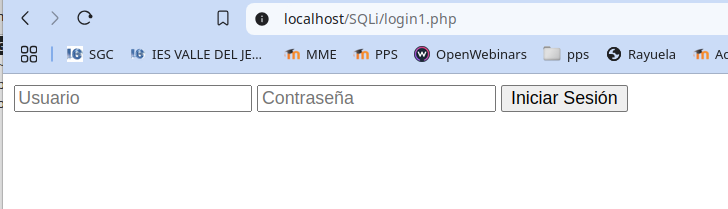

Podemos ver los datos de nuestros usuarios desde PHPMyAdmin en la siguientes dirección: <http://localhost:8080/index.php?route=/sql&pos=0&db=SQLi&table=usuarios>

Como podemos ver en la imagen, el usuario **admin** tiene contraseña **admin123**.

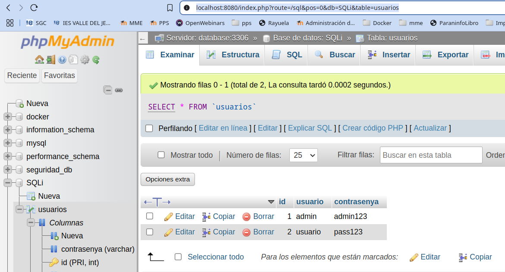

Con los datos que hemos introducido en los campos de consulta, hace una consulta a la BBDD para ver si el usuario y contraseña introducido son correctos.

Ya tendremos preparado nuestro servidor web para poder ver las vulnerabilidades de Inyección SQL. Accedemos desde `http://localhost/SQLi/login1.php`

Si introducimos el usuario **admin** y la contraseña **admin123** la consulta dice que es usuario y contraseña correcta y nos dejaría logearnos en la página.

Como vemos, el problema se produce debido a que hacemos la consulta que hacemos a la base de datos es la siguiente:

`$query = "SELECT * FROM usuarios WHERE usuario = '$username' AND contrasenya = '$password'"`

Estamos construyendo la consulta directamenbte con lo escrito en los campos de usuario y contraseña. Podemos cambiar el sentido de la consulta si utilizamos las comillas simples "'".

## Explotación de Inyección SQL

Podemos inyectar infinidad de código. Entre ello, podemos hacer ataques de:

**Bypass de autenticación**

Para realizar la explotación, en el campo "Usuario" ingresar:

~~~
' OR '1'='1' -- -
~~~

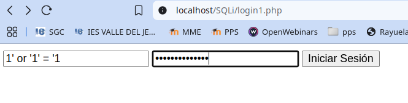

> Resultado esperado: Inicia sesión sin credenciales válidas.

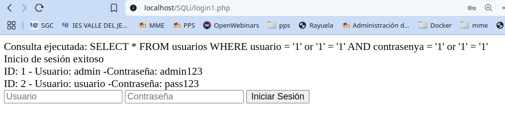

**Obtener credenciales de la base de datos**

Para realizar la explotación, en el campo "Usuario" ingresar:

~~~
' UNION SELECT NULL, usuario, contrasenya FROM usuarios #
~~~

> Resultado esperado: Se muestran todos los usuarios y contraseñas.

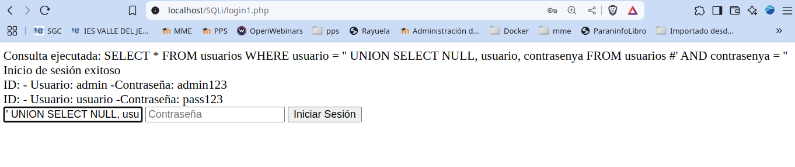

**Problemas del primer código (Inseguro)**
---

1. **Vulnerabilidad a inyección SQL**

	- La consulta SQL inserta directamente los valores del usuario ('$username' AND password = '$password').

	- No se usan consultas preparadas.

2. **Contraseñas almacenadas en texto plano**

	- La base de datos parece almacenar las contraseñas en texto sin cifrar.

	- Esto es una mala práctica, ya que si la base de datos es comprometida, todas las contraseñas quedan expuestas.

3. **Falta de validación y sanitización de entrada**

	- No hay ningún tipo de limpieza en los valores obtenidos de $_POST, lo que facilita ataques como XSS o inyecciones maliciosas.

4. **No se maneja la conexión a la base de datos adecuadamente**

	- No se verifica si la conexión es exitosa.

	- No se cierra la conexión después de ejecutar la consulta.

## Mitigación de vulnerabiliad

Para ir incorporando soluciones, sin eliminar las anteriores versiones, vamos a crear a partir del archivo anterior, otro en el que modificar cosas para ir aproximádonos a la mejor solución:
 
~~~
cp login1.php login2.php 
~~~

### Primera mitigación, escapar los caracteres especiales.

Nuestro login2.php debe de tener el siguiente contenido

~~~
<?php
$conn = new mysqli("database", "root", "password", "SQLi");
        if ($_SERVER["REQUEST_METHOD"] == "POST") {
                $username = $_POST["username"];
                $password = $_POST["password"];
                $username = addslashes($username);
                $password = addslashes($password);
                $query= "SELECT * FROM usuarios WHERE usuario = '$username' AND contrasenya = '$password'";
                echo "Consulta ejecutada: " . $query . " ";
                $result = $conn->query($query);
                if ($result) {
                        if ($result->num_rows > 0) {
                                echo "Inicio de sesión exitoso ";
                                // Modificación: Mostrar datos extraídos de la consulta
                                while ($row = $result->fetch_assoc()) {
                                        echo "ID: " . $row['id'] . " - Usuario: " . $row['usuario'] . " -Contraseña: " . $row['contrasenya'] . " ";
                                }
                } else {
                        echo "Usuario o contraseña incorrectos";
                }
        } else {
                echo "Error en la consulta: " . $conn->error;
        }
}
?>
<form method="post">
        <input type="text" name="username" placeholder="Usuario">
        <input type="password" name="password" placeholder="Contraseña">
        <button type="submit">Iniciar Sesión</button>
</form>

~~~
Como vemos, podemos incluir consultas dentro de los campos, al utilizar caracteres especiales como las comillas.

Por lo tanto la primera aproximación sería escapar esos caracteres especiales de los valores de la consulta.

La función **addslashes()** nos permite hacerlo, ya que Devuelve una cadena con barras invertidas delante de los caracteres que necesitan escaparse en situaciones como consultas de bases de datos, etc. Los caracteres que se escapan son la comilla simple ('), comilla doble ("), barra invertida (\) y NUL (el byte NULL).

Por lo tanto, modificamos el archivo anterior, introduciendo las lineas de escape de caracteres especiales tanto del campo de usuario como de la contraseña.

El resultado es que ya no funciona la inyección SQL:

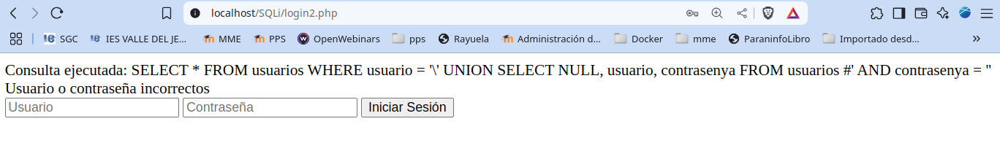

**Mejoras en el segundo código (Más seguro, pero aún con problemas)**

1. Uso de consultas preparadas.

	- Se usa $stmt->prepare() y bind_param(), lo que previene inyección SQL.

	- Ventaja: No importa qué ingrese el usuario, la consulta tratará los valores como datos, no como código ejecutable.

2. Se valida la conexión a la base de datos.

	- Se verifica si connect_error devuelve un error antes de continuar.

	- Si hay un fallo, el script termina con die(), lo que evita que se ejecuten consultas en una conexión fallida.

3. Se escapan los caracteres especiales con la función **addslashes()**.

4. Manejo de la conexión a la base de datos.

	- Se cierra la consulta (**$stmt->close()**) y la conexión (**$conn->close()**) correctamente.

**Problemas que aún tiene el segundo código** 

1. Las contraseñas siguen almacenándose en texto plano.

	- Aunque se evita la inyección SQL, el código sigue comparando contraseñas directamente en la base de datos.

	- Solución correcta: Almacenar las contraseñas con **password\_hash()** y verificar con **password\_verify()**.

2. Mensajes de error genéricos

	- Se sigue mostrando información detallada sobre los usuarios si la consulta es exitosa.

	- Lo correcto sería iniciar una sesión en lugar de mostrar información del usuario.

3. No hay control de sesiones

	- A pesar de corregir varios problemas de seguridad, no se establece una sesión segura (session_start()) después de una autenticación exitosa.

## Código mejorado uso consultas parametrizadas

VAmos a intentar incorporar esas mejoras:

~~~
<?php
$conn = new mysqli("database", "root", "password", "SQLi");

// Verificar conexión
if ($conn->connect_error) {
    die("Error de conexión: " . $conn->connect_error);
}

if ($_SERVER["REQUEST_METHOD"] == "POST") {
    $username = $_POST["username"] ?? '';
    $password = $_POST["password"] ?? '';

    // Verificar si los campos están vacíos
    if (empty($username) || empty($password)) {
        die("Error: Usuario y contraseña son obligatorios.");
    }

    // Consulta segura con prepared statements
    $query = "SELECT id, usuario, contrasenya FROM usuarios WHERE usuario = ?";
    $stmt = $conn->prepare($query);
    
    if (!$stmt) {
        die("Error en la preparación de la consulta: " . $conn->error);
    }

    $stmt->bind_param("s", $username);
    $stmt->execute();
    $result = $stmt->get_result();

    if ($result && $result->num_rows > 0) {
        $row = $result->fetch_assoc();
        
        // Verificar contraseña hasheada (suponiendo uso de password_hash())
        if (password_verify($password, $row["contrasenya"])) {
            echo "Inicio de sesión exitoso ";
            echo "ID: " . htmlspecialchars($row['id']) . " - Usuario: " . htmlspecialchars($row['usuario']) . " ";
        } else {
            echo "Usuario o contraseña incorrectos";
        }
    } else {
        echo "Usuario o contraseña incorrectos";
    }

    $stmt->close();
}

$conn->close();
?>

<form method="post">
    <input type="text" name="username" placeholder="Usuario">
    <input type="password" name="password" placeholder="Contraseña">
    <button type="submit">Iniciar Sesión</button>
</form>
~~~

**Explicación de las mejoras**
---
✅ Consultas preparadas: **prepare()** y **bind_param()** protegen contra SQL Injection.

✅ Eliminación de addslashes(): No es necesario con consultas preparadas.

✅ Escapado de salida con **htmlspecialchars()**: Evita XSS en los datos mostrados.

✅ Uso de **password_hash()** y **password_verify()**: Si las contraseñas en la base de datos no están hasheadas, hay que actualizarlas con password_hash().

 Guardar las contraseñas en BBDD con la función **password_hash()**:

Si las contraseñas aún no están almacenadas con **password_hash()**, a la hora de guardar las contraseñas en la BBDD, en PHP necesitarás guardarlas con algo como:

~~~
$hashed_password = password_hash("tu_contraseña", PASSWORD_DEFAULT);
~~~

A la hora de leerla usaríamos la función:  **password_verify()**	

## ENTREGA
---
>__Realiza las operaciones indicadas__

>__Crea un repositorio  con nombre PPS-Unidad3Actividad4-Tu-Nombre donde documentes la realización de ellos.__

> No te olvides de documentarlo convenientemente con explicaciones, capturas de pantalla, etc.

>__Sube a la plataforma, tanto el repositorio comprimido como la dirección https a tu repositorio de Github.__
